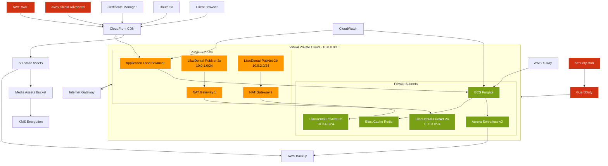

# LilacDental Website Architecture

## Overview

This document outlines the comprehensive infrastructure architecture for the LilacDental website, combining AWS network infrastructure with backend services.



## Network Architecture

### VPC Configuration
- **CIDR Block**: 10.0.0.0/16
- **Region**: us-east-1
- **Availability Zones**: us-east-2a, us-east-2b

### Subnet Layout
- **Public Subnets**:
  - LilacDental-PubNet-2a: 10.0.1.0/24
  - LilacDental-PubNet-2b: 10.0.2.0/24
  - Purpose: ALB, NAT Gateway, Bastion Host

- **Private Subnets**:
  - LilacDental-PrivNet-2a: 10.0.3.0/24
  - LilacDental-PrivNet-2b: 10.0.4.0/24
  - Purpose: Application components, databases

### Route Tables
- **LilacDental-PubRT-2a**:
  - Associated with: LilacDental-PubNet-2a
  - Routes:
    - Local traffic (10.0.0.0/16)
    - Internet traffic (0.0.0.0/0) → Internet Gateway

- **LilacDental-PubRT-2b**:
  - Associated with: LilacDental-PubNet-2b
  - Routes:
    - Local traffic (10.0.0.0/16)
    - Internet traffic (0.0.0.0/0) → Internet Gateway

- **LilacDental-PrivRT-2a**:
  - Associated with: LilacDental-PrivNet-2a
  - Routes:
    - Local traffic (10.0.0.0/16)
    - Internet traffic (0.0.0.0/0) → NAT Gateway 1

- **LilacDental-PrivRT-2b**:
  - Associated with: LilacDental-PrivNet-2b
  - Routes:
    - Local traffic (10.0.0.0/16)
    - Internet traffic (0.0.0.0/0) → NAT Gateway 2

### Security Groups
1. **ALB Security Group**:
   ```
   Inbound:
   - 443 (HTTPS) from 0.0.0.0/0
   
   Outbound:
   - All traffic to VPC CIDR
   ```

2. **Application Security Group**:
   ```
   Inbound:
   - 443 (HTTPS) from ALB Security Group
   
   Outbound:
   - All traffic to VPC CIDR
   ```

3. **Database Security Group**:
   ```
   Inbound:
   - 5432 (PostgreSQL) from Application Security Group
   
   Outbound:
   - All traffic to VPC CIDR
   ```

### Network Components
- Internet Gateway
- NAT Gateway in each AZ
- VPC Endpoints for AWS services
- Transit Gateway for future expansion

## Component Architecture

### Frontend Layer
- **CloudFront Distribution**:
  - SSL/TLS termination
  - Edge caching
  - Custom domain support
  - WAF integration

- **S3 Bucket**:
  - Static asset hosting
  - Versioning enabled
  - Lifecycle policies
  - Server-side encryption

### Backend Services
- **AWS Services**:
  - ECS Fargate
  - Aurora Serverless
  - ElastiCache Redis
  - CloudWatch monitoring

### Security Architecture

#### Network Security
- VPC Flow Logs
- Security Groups
- Network ACLs
- AWS Shield Advanced

#### Application Security
- WAF rules
- Rate limiting
- Input validation
- CORS policies

#### Data Protection
- KMS encryption
- SSL/TLS
- Backup encryption
- IAM policies

### High Availability
- Multi-AZ deployment
- Auto-scaling
- Load balancing
- Health checks

### Disaster Recovery
- Cross-region backups
- Point-in-time recovery
- RPO: 24 hours
- RTO: 4 hours

## Form Submission Flow

1. **Client Submission**:
   ```
   Browser -> CloudFront -> ALB -> Edge Function
   ```

2. **Processing**:
   ```
   Edge Function -> Aurora -> PostgreSQL
   ```

3. **Notification**:
   ```
   Edge Function -> SES -> Admin Email
   ```

## Monitoring & Logging

### CloudWatch Metrics
- Request latency
- Error rates
- CPU/Memory usage
- Database connections

### Logging
- Application logs
- Access logs
- Security logs
- Audit trails

## Cost Optimization

### Storage Tiers
- S3 Intelligent-Tiering
- Aurora Serverless scaling
- Reserved Instances
- Savings Plans

### Caching Strategy
- CloudFront caching
- Browser caching
- API response caching
- Database query caching

## Compliance & Security

### HIPAA Compliance
- Encryption at rest
- Encryption in transit
- Access controls
- Audit logging

### Security Controls
- MFA enforcement
- Regular audits
- Penetration testing
- Vulnerability scanning

## Maintenance Procedures

### Deployments
- Blue-green deployment
- Canary releases
- Rollback procedures
- Health checks

### Backup Strategy
- Daily automated backups
- Cross-region replication
- Retention policies
- Recovery testing

## Performance Optimization

### CDN Configuration
- Edge caching
- Origin shield
- Compression
- HTTP/2 support

### Database Optimization
- Connection pooling
- Query optimization
- Index management
- Vacuum scheduling

## Component Names and Purposes

### DNS & Domain Components
- **LilacDental-DNS**: Route 53 hosted zone for domain management
- **LilacDental-SSL**: ACM certificate for secure communications
- **LilacDental-CDN**: CloudFront distribution for content delivery

### Security Components
- **LilacDental-WAF**: Web Application Firewall for threat protection
- **LilacDental-Shield**: DDoS protection service
- **LilacDental-Guard**: GuardDuty for threat detection
- **LilacDental-SecHub**: Security Hub for security management

### Network Components
- **LilacDental-VPC**: Main Virtual Private Cloud (10.0.0.0/16)
- **LilacDental-PubNet-1a**: Public subnet in AZ1 (10.0.1.0/24)
- **LilacDental-PubNet-1b**: Public subnet in AZ2 (10.0.2.0/24)
- **LilacDental-PrivNet-1a**: Private subnet in AZ1 (10.0.3.0/24)
- **LilacDental-PrivNet-1b**: Private subnet in AZ2 (10.0.4.0/24)
- **LilacDental-IGW**: Internet Gateway for public access
- **LilacDental-NAT-1a**: NAT Gateway in AZ1
- **LilacDental-NAT-1b**: NAT Gateway in AZ2

### Load Balancer & Application Components
- **LilacDental-ALB**: Application Load Balancer
- **LilacDental-ECS**: ECS Fargate cluster for containerized applications
- **LilacDental-Cache**: ElastiCache Redis cluster
- **LilacDental-Aurora**: Aurora Serverless database cluster

### Storage Components
- **LilacDental-Assets**: S3 bucket for static website assets
- **LilacDental-Media**: S3 bucket for patient media storage
- **LilacDental-Backup**: AWS Backup vault for data protection

### Security Groups
- **LilacDental-ALB-SG**: Security group for load balancer
- **LilacDental-App-SG**: Security group for application containers
- **LilacDental-DB-SG**: Security group for database access

### Monitoring Components
- **LilacDental-CloudWatch**: CloudWatch for monitoring and alerts
- **LilacDental-XRay**: X-Ray for application tracing
- **LilacDental-Logs**: CloudWatch Logs for centralized logging

### Encryption & Key Management
- **LilacDental-KMS**: KMS key for data encryption
- **LilacDental-SecretsManager**: For managing application secrets

This architecture provides a secure, scalable, and maintainable infrastructure that combines AWS networking capabilities with backend services for optimal performance and reliability.