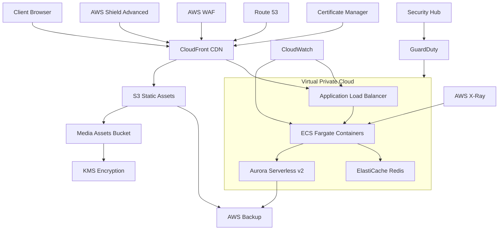

# Modern Dental Clinic Website Architecture

## Overview

This document outlines the comprehensive infrastructure architecture for the Modern Dental Clinic website, combining AWS network infrastructure with Supabase backend services.



## Network Architecture

### VPC Configuration
- **CIDR Block**: 10.0.0.0/16
- **Region**: us-east-1
- **Availability Zones**: us-east-1a, us-east-1b

### Subnet Layout
- **Public Subnets**:
  - us-east-1a: 10.0.1.0/24
  - us-east-1b: 10.0.2.0/24
  - Purpose: ALB, NAT Gateway, Bastion Host

- **Private Subnets**:
  - us-east-1a: 10.0.3.0/24
  - us-east-1b: 10.0.4.0/24
  - Purpose: Application components, databases

### Security Groups
1. **ALB Security Group**:
   ```
   Inbound:
   - 443 (HTTPS) from 0.0.0.0/0
   
   Outbound:
   - All traffic to VPC CIDR
   ```

2. **Application Security Group**:
   ```
   Inbound:
   - 443 (HTTPS) from ALB Security Group
   
   Outbound:
   - All traffic to VPC CIDR
   ```

3. **Database Security Group**:
   ```
   Inbound:
   - 5432 (PostgreSQL) from Application Security Group
   
   Outbound:
   - All traffic to VPC CIDR
   ```

### Network Components
- Internet Gateway
- NAT Gateway in each AZ
- VPC Endpoints for AWS services
- Transit Gateway for future expansion

## Component Architecture

### Frontend Layer
- **CloudFront Distribution**:
  - SSL/TLS termination
  - Edge caching
  - Custom domain support
  - WAF integration

- **S3 Bucket**:
  - Static asset hosting
  - Versioning enabled
  - Lifecycle policies
  - Server-side encryption

### Backend Services
- **Supabase Integration**:
  - PostgreSQL database
  - Authentication
  - Storage
  - Edge Functions

- **AWS Services**:
  - ECS Fargate
  - Aurora Serverless
  - ElastiCache Redis
  - CloudWatch monitoring

### Security Architecture

#### Network Security
- VPC Flow Logs
- Security Groups
- Network ACLs
- AWS Shield Advanced

#### Application Security
- WAF rules
- Rate limiting
- Input validation
- CORS policies

#### Data Protection
- KMS encryption
- SSL/TLS
- Backup encryption
- IAM policies

### High Availability
- Multi-AZ deployment
- Auto-scaling
- Load balancing
- Health checks

### Disaster Recovery
- Cross-region backups
- Point-in-time recovery
- RPO: 24 hours
- RTO: 4 hours

## Form Submission Flow

1. **Client Submission**:
   ```
   Browser -> CloudFront -> ALB -> Edge Function
   ```

2. **Processing**:
   ```
   Edge Function -> Supabase -> PostgreSQL
   ```

3. **Notification**:
   ```
   Edge Function -> SES -> Admin Email
   ```

## Monitoring & Logging

### CloudWatch Metrics
- Request latency
- Error rates
- CPU/Memory usage
- Database connections

### Logging
- Application logs
- Access logs
- Security logs
- Audit trails

## Cost Optimization

### Storage Tiers
- S3 Intelligent-Tiering
- Aurora Serverless scaling
- Reserved Instances
- Savings Plans

### Caching Strategy
- CloudFront caching
- Browser caching
- API response caching
- Database query caching

## Compliance & Security

### HIPAA Compliance
- Encryption at rest
- Encryption in transit
- Access controls
- Audit logging

### Security Controls
- MFA enforcement
- Regular audits
- Penetration testing
- Vulnerability scanning

## Maintenance Procedures

### Deployments
- Blue-green deployment
- Canary releases
- Rollback procedures
- Health checks

### Backup Strategy
- Daily automated backups
- Cross-region replication
- Retention policies
- Recovery testing

## Performance Optimization

### CDN Configuration
- Edge caching
- Origin shield
- Compression
- HTTP/2 support

### Database Optimization
- Connection pooling
- Query optimization
- Index management
- Vacuum scheduling

This architecture provides a secure, scalable, and maintainable infrastructure that combines AWS networking capabilities with Supabase backend services for optimal performance and reliability.